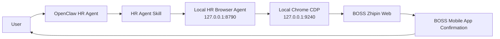
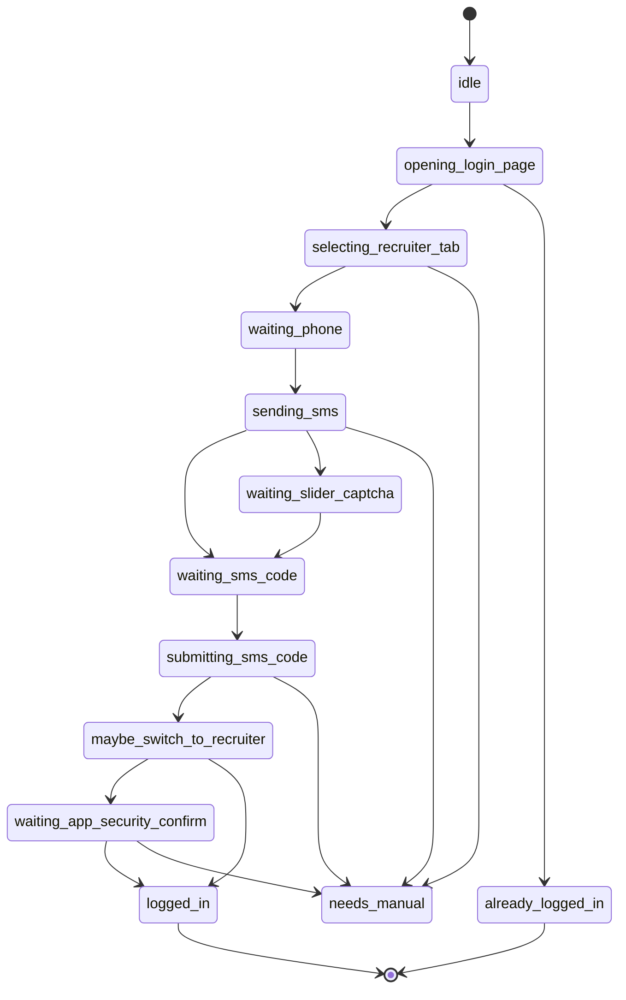

# HR Browser Agent Design

This document describes the first product step for the HR agent: let the user talk to an OpenClaw HR agent, while a local browser service on the user's machine operates BOSS Zhipin pages.

The goal is not only data capture. The goal is a controllable HR browser assistant that can log in, reach recruiter mode, and later operate workflows such as posting JDs, searching candidates, opening resumes, and messaging.

## Product Boundary

The HR Browser Agent runs on the user's own computer and controls a visible Chrome profile through CDP. OpenClaw talks to this local service through HTTP.

It can:

- Open BOSS login pages in a local Chrome profile.
- Click "我要招聘" when the login page defaults to "我要找工作".
- Enter the user's phone number after the user provides it.
- Click "发送验证码".
- Enter the SMS verification code after the user provides it.
- Click "切换" if BOSS asks to switch identity from job seeker to recruiter.
- Detect BOSS safety verification pages and ask the user to confirm in the BOSS mobile app.
- Persist login state in a local Chrome user data directory.
- Report status back to OpenClaw.

It must not:

- Store account passwords, phone numbers, SMS codes, or raw auth tokens.
- Log SMS codes or phone numbers in plaintext.
- Bypass BOSS security verification, CAPTCHA, or mobile app confirmation.
- Expose CDP or browser-control APIs to the public internet.

## Architecture



Default deployment is single-user local:

- OpenClaw runs on the user's machine.
- HR Browser Agent binds to `127.0.0.1`.
- Chrome remote debugging binds to `127.0.0.1`.
- The BOSS session is stored in a local profile such as `/tmp/boss-hr-agent-recruiter`.

If OpenClaw runs on another machine, put the service behind a private network/VPN and require an API token. Do not expose the browser service publicly.

## Components

### `boss_hr_browser_agent.py`

FastAPI service for browser control and state management.

Responsibilities:

- Launch or connect to Chrome CDP.
- Find or create a BOSS login page target.
- Execute safe page actions.
- Maintain an in-memory login state machine.
- Return structured status for OpenClaw.
- Redact sensitive input in logs.

### `boss_login_flow.py`

BOSS-specific login workflow.

Responsibilities:

- Detect login page shape.
- Select recruiter mode.
- Fill phone.
- Send SMS code.
- Submit SMS code.
- Detect seeker-to-recruiter switch dialog.
- Detect app safety verification page.
- Detect successful recruiter login.

### `scripts/start_boss_hr_agent.sh`

Convenience script for the user's machine.

Responsibilities:

- Start Chrome with remote debugging.
- Use a dedicated recruiter profile.
- Start the local FastAPI service.
- Print health-check and OpenClaw configuration instructions.

### `docs/openclaw_hr_agent_skill.md`

Skill instructions for the OpenClaw HR agent.

Responsibilities:

- Define when to call the local service.
- Define how to ask for phone and SMS code.
- Define how to handle app confirmation and manual intervention.
- Define safe language around BOSS verification.

## Local Startup

Expected MVP command:

```bash
cd "/path/to/candidate-intel-agent"
npm install
python3 -m venv .venv
.venv/bin/pip install -r requirements.txt

HR_AGENT_HOST=127.0.0.1 HR_AGENT_PORT=8790 ./scripts/start_boss_hr_agent.sh
```

Equivalent npm shortcut:

```bash
npm run hr:start
```

The script should start Chrome like this:

```bash
open -na "Google Chrome" --args \
  --remote-debugging-port=9240 \
  --remote-allow-origins=http://127.0.0.1:9240 \
  --user-data-dir=/tmp/boss-hr-agent-recruiter \
  --no-first-run \
  "https://www.zhipin.com/web/user/?ka=header-login"
```

Then start:

```bash
PYTHONPATH=python .venv/bin/uvicorn boss_hr_browser_agent:app \
  --host 127.0.0.1 \
  --port 8790
```

Health check:

```bash
curl http://127.0.0.1:8790/health
```

Expected:

```json
{
  "ok": true,
  "service": "boss-hr-browser-agent",
  "browser": {
    "cdp_url": "http://127.0.0.1:9240",
    "profile": "/tmp/boss-hr-agent-recruiter"
  }
}
```

## Login State Machine



Status values:

| Status | Meaning | OpenClaw behavior |
| --- | --- | --- |
| `idle` | Service is ready but login flow has not started. | Call `start`. |
| `opening_login_page` | Chrome is opening BOSS login. | Wait or poll. |
| `waiting_phone` | Login page is ready for phone. | Ask user for phone. |
| `sending_sms` | Agent is filling phone and clicking send code. | Wait. |
| `waiting_slider_captcha` | BOSS requires manual slider puzzle verification. | Ask user to solve slider in browser, poll. |
| `waiting_sms_code` | BOSS sent or is ready for SMS code. | Ask user for code. |
| `submitting_sms_code` | Agent is submitting SMS code. | Wait. |
| `maybe_switch_to_recruiter` | BOSS may show identity switch. | Agent clicks switch if visible. |
| `waiting_app_security_confirm` | BOSS requires phone app confirmation. | Ask user to confirm in app. |
| `logged_in` | Recruiter web login succeeded. | Continue HR workflows. |
| `already_logged_in` | Existing Chrome profile is already logged in. | Continue HR workflows. |
| `needs_manual` | Page shape is unknown or blocked. | Ask user to look at browser. |
| `failed` | The operation failed. | Report concise error. |

## API Contract

### `GET /health`

Checks local service and configured browser.

### `POST /v1/browser/start`

Starts or connects to the recruiter Chrome profile and opens BOSS login page.

Request:

```json
{
  "start_url": "https://www.zhipin.com/web/user/?ka=header-login",
  "profile_dir": "/tmp/boss-hr-agent-recruiter",
  "cdp_port": 9240
}
```

Response:

```json
{
  "status": "opening_login_page",
  "message": "已打开 BOSS 登录页。",
  "browser_url": "http://127.0.0.1:9240"
}
```

### `POST /v1/boss/login/start`

Starts the BOSS recruiter login wizard. This should select "我要招聘" if needed.

Request:

```json
{}
```

Response:

```json
{
  "status": "waiting_phone",
  "needs_input": "phone",
  "message": "请输入用于登录 BOSS 招聘者账号的手机号。"
}
```

If already logged in:

```json
{
  "status": "already_logged_in",
  "role": "recruiter",
  "message": "当前 Chrome profile 已经是招聘者登录状态。"
}
```

### `POST /v1/boss/login/send-code`

Fills the phone number, checks the agreement checkbox when present, and clicks "发送验证码".

Request:

```json
{
  "phone": "13800138000"
}
```

Logging rule: redact as `138****8000`.

Response:

```json
{
  "status": "waiting_sms_code",
  "needs_input": "sms_code",
  "message": "验证码已发送，请输入短信验证码。"
}
```

If BOSS shows a slider puzzle after clicking send code:

```json
{
  "status": "waiting_slider_captcha",
  "needs_input": "manual_slider",
  "message": "BOSS 出现滑动拼图验证。请在浏览器里手动完成滑块验证，我会继续等待短信验证码状态。"
}
```

The agent must not try to solve or bypass the puzzle. It should ask the user to solve it in the visible browser, then poll `GET /v1/boss/login/status`.

### `POST /v1/boss/login/submit-code`

Fills and submits the SMS code.

Request:

```json
{
  "sms_code": "123456"
}
```

Logging rule: never log the SMS code.

Possible responses:

```json
{
  "status": "maybe_switch_to_recruiter",
  "message": "检测到身份切换弹窗，正在切换到招聘者。"
}
```

```json
{
  "status": "waiting_app_security_confirm",
  "needs_input": "app_confirm",
  "message": "BOSS 需要在手机 App 完成安全登录确认。请在手机上打开 BOSS 直聘并点击确认。"
}
```

```json
{
  "status": "logged_in",
  "role": "recruiter",
  "message": "BOSS 招聘者账号登录成功。"
}
```

### `GET /v1/boss/login/status`

Polls the current login state.

Response:

```json
{
  "status": "waiting_app_security_confirm",
  "needs_input": "app_confirm",
  "current_url": "https://www.zhipin.com/web/user/user-safe?...",
  "message": "请在手机 BOSS 直聘 App 里点击确认。"
}
```

When the user confirms in the phone app:

```json
{
  "status": "logged_in",
  "role": "recruiter",
  "current_url": "https://www.zhipin.com/web/chat/index",
  "message": "已完成安全确认并进入招聘者状态。"
}
```

### `POST /v1/boss/navigate`

Navigates after login.

Request:

```json
{
  "target": "talent_search"
}
```

Allowed targets:

- `talent_search`: `/web/chat/search`
- `job_manage`: recruiter job management page
- `post_job`: post job flow
- `home`: recruiter home

## Login Detection Heuristics

The login flow should rely on DOM text plus URL:

- Login page: URL contains `/web/user`, visible text contains `验证码登录/注册`.
- Recruiter tab needed: visible text contains both `我要找工作` and `我要招聘`; active state is not recruiter.
- SMS ready: visible text contains `发送验证码`.
- Slider puzzle: visible text contains `向右拖动滑块`, `拖动滑块填充拼图`, or `完成拼图`.
- Switch dialog: visible text contains `是否将身份切为招聘者` and a button `切换`.
- Safety page: URL contains `/web/user/user-safe` or visible text contains `安全验证`, `请在手机上打开BOSS直聘`, `确认`.
- Success: URL is no longer `/web/user`; page has recruiter navigation text such as `职位管理`, `推荐牛人`, `搜索`, `沟通`, `牛人管理`.

Every detection should include a fallback:

- If a selector fails, search by visible text.
- If visible text is ambiguous, return `needs_manual` with a screenshot path or concise browser instruction.

## Security Rules

- Bind service to `127.0.0.1` by default.
- Require an API token before binding to `0.0.0.0`.
- Do not persist phone or SMS code.
- Redact phone in logs and responses unless the user is actively entering it.
- Never log SMS code.
- Keep Chrome visible for login and safety confirmation.
- Do not run login flow in headless mode.
- Do not attempt to bypass security verification.

## OpenClaw UX Rules

The HR agent should be calm and direct:

- Tell the user when the browser is opened.
- Ask for phone only when the service returns `waiting_phone`.
- Ask for SMS code only when the service returns `waiting_sms_code`.
- Ask the user to solve the visible slider only when the service returns `waiting_slider_captcha`.
- Tell the user to confirm in the mobile app when status is `waiting_app_security_confirm`.
- Avoid asking the user to click things in the browser unless status is `waiting_slider_captcha` or `needs_manual`.
- Never claim login is complete until service returns `logged_in` or `already_logged_in`.

## Implementation Milestones

### Milestone 1: Login Wizard

- Add `boss_hr_browser_agent.py`.
- Add `boss_login_flow.py`.
- Add `scripts/start_boss_hr_agent.sh`.
- Implement health, browser start, login start, send code, submit code, status.
- Manual QA with the three screenshots' flows:
  - recruiter tab selection
  - seeker-to-recruiter switch
  - app safety confirmation

### Milestone 2: Recruiter Navigation

- Add navigation endpoints for talent search, job management, and post job.
- Verify persisted login state across service restarts.

### Milestone 3: HR Actions

- Add structured actions:
  - draft/post JD
  - search candidates
  - open candidate resume
  - summarize visible candidate
  - save visible candidate to local DB

### Milestone 4: Product Hardening

- Add local API token.
- Add structured action audit logs with redaction.
- Add screenshot-on-error.
- Add OpenClaw skill examples and recovery playbooks.
